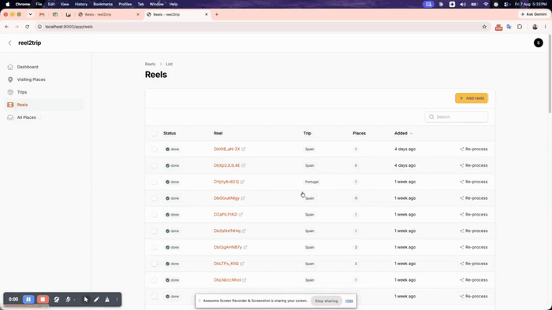

# reel2trip — Instagram reels → a trip you can plan

Paste reel URLs. Get back the places those reels talked about, grouped by city
and category, ready to assign to days or export to Google Maps.

Transcription and extraction both run on your own machine. No API key, no
per-reel cost, nothing sent to a model provider.



**[Watch the full demo (84s)](docs/full-demo.mp4)** — dashboard, trips, pasting a
reel, the pipeline running, the transcript, the Instagram post it came from,
and the must-do list it ends up in.

## What it does

```
Add reels (paste URLs in the panel)
        │
        ▼
ProcessReel job (queued, retries with backoff)
  1. InstagramDownloader   yt-dlp → video + caption
  2. WhisperTranscriber    ffmpeg → mp3 → whisper.cpp (local) → transcript
  3. ReelPlaceExtractor    caption + transcript + OCR → Ollama (local) → JSON places
        │
        ▼ (one per place)
EnrichPlace job
  4. Geocoder              name + city → lat/lng, rating, price, hours
```

## The panel

Everything happens in a Filament panel at `/app`.

| Page | What it is for |
|---|---|
| **Dashboard** | Reels processed, places found, how many are on your list, what is still working |
| **Visiting Places** | The plan: city → category → places, or city → day → places |
| **Trips** | A trip holds its cities and their order |
| **Reels** | Paste URLs, watch the pipeline, read a transcript, re-run a reel |
| **All Places** | Everything extracted, including what you have not chosen yet |

### Reels

**Add reels** takes any number of URLs, one per line, and queues them. The
status badge walks `pending → downloading → transcribing → extracting → done`
and the table polls itself while anything is still moving.

A URL that is already stored is skipped rather than processed twice, and the
notification names the shortcode it skipped. To run a reel again — through a
better model, or a changed prompt — use **Re-process** on its row. **Transcript**
opens what Whisper heard and what the model pulled out of it.

### Visiting Places

Mark a place as *Visiting* on All Places and it appears here, grouped by city
and then by category:

```
Barcelona · Spain · 3 days · 12 places
  Attractions 4
    Sagrada Familia   ★ Must do   ★ 4.7   Day 2
    Park Güell
  Food & Drink 5
    Bar Cañete        💡 Sit at the bar, no reservation before 8pm
  Viewpoints 3
```

Switch **Group by** to *Day* and the same places regroup into Day 1, Day 2 and
a "Not scheduled yet" bucket, with every day the city has shown even when it is
still empty. Each row has a day picker, a must-do star, a link to the place on
Google Maps, and a way off the list.

Filters for trip, category, must-do and free text all live in the URL, so a
filtered list is a link you can keep.

## Exporting to Google Maps

Two exports, both honouring whatever the page is filtered to.

**Export for Google My Maps** writes a CSV: `Name, Latitude, Longitude,
Category, Description, Address, MustDo, Reel`. Import it at
[mymaps.google.com](https://mymaps.google.com) → Create a new map → Import,
then choose Latitude/Longitude as the position columns and Name as the title
column.

**Export KML** writes one `<Folder>` per city, which opens in Google Earth and
also imports into My Maps.

Worth knowing about the two:

- A place with no coordinates still exports to CSV, with the lat/lng columns
  blank and `name, city, country` in Address, which My Maps geocodes on import.
  KML needs a real coordinate, so those places are dropped from it.
- `MustDo` is the words "Must do" rather than a boolean, because My Maps prints
  the column on the pin.
- The CSV opens with a byte order mark. Without it, Excel and My Maps both
  render Málaga and Casa Batlló as mojibake.
- Tips are never exported. They are advice, not somewhere to stand.

## Setup

1. Install and migrate:

   ```bash
   composer install
   npm install
   php artisan migrate
   ```

2. System dependencies on whatever runs the queue worker:

   ```bash
   brew install ffmpeg yt-dlp ollama       # or apt / pipx
   ollama pull qwen2.5:3b
   ```

   Transcription needs `whisper-cli` from [whisper.cpp](https://github.com/ggerganov/whisper.cpp)
   and a ggml model at `storage/app/whisper-models/ggml-base.en.bin`. Without
   them the pipeline still runs and extracts from the caption alone.

3. Build the assets. This is not optional: the panel uses a custom Filament
   theme resolved through the Vite manifest, so every panel page 500s until
   `public/build` exists.

   ```bash
   npm run build
   ```

4. Create a user and a trip, then add cities to the trip in the panel. A trip
   holds its cities, and a city holds the places its reels produced.

5. Run the worker. `nice` matters: whisper.cpp and a local LLM will otherwise
   compete with your desktop for CPU.

   ```bash
   nice -n 15 php artisan queue:work --timeout=300
   ```

   On 8GB of RAM or less keep `OLLAMA_MODEL` at a 3b model. A 7b needs ~4.7GB
   resident and drives the whole machine into swap. Start ollama with
   `OLLAMA_KEEP_ALIVE=10s OLLAMA_MAX_LOADED_MODELS=1` so it releases that
   memory between reels instead of holding it for five minutes.

`composer dev` runs the server, a niced queue listener, logs and Vite together.

## Keys

Transcription and extraction run on-device, so neither needs a key.

| Key | Used for | Notes |
|---|---|---|
| `OLLAMA_MODEL` | place extraction | local, no key. Defaults to `qwen2.5:3b` |
| `OLLAMA_KEEP_ALIVE` | memory | how long ollama holds the weights. Defaults to `10s` |
| `WHISPER_BIN` / `WHISPER_MODEL` | transcription | `whisper-cli` plus a ggml file, no key |
| `WHISPER_THREADS` | transcription | defaults to 3, one fewer than whisper's default |
| `GEOCODER_DRIVER` | enrichment | `nominatim` (free, rate limited) or `google` |
| `GOOGLE_PLACES_API_KEY` | enrichment | only for the `google` driver |
| `INSTAGRAM_COOKIES_FILE` | optional | Netscape cookies export; helps yt-dlp past login walls |

There are also two JSON endpoints, handy for debugging or a future map view:
`GET /api/reels` and `GET /api/cities/{tripCity}/places`.

## Design decisions worth knowing

- **One idempotent job, not a chain.** Each stage checks whether its output
  already exists, so a retry after a rate limit does not redo transcription and
  extraction that already succeeded. Extraction wipes and rewrites its places,
  so a re-run never leaves duplicates behind.
- **`city_guess` vs `trip_city_id`.** The extractor records what the reel
  *said*; the job then matches that against your trip's cities, accent-folded so
  "Malaga" finds "Málaga". Unmatched places keep their guess so you can assign
  them by hand.
- **Sloppy categories are normalized, not dropped.** The model reaches for
  "restaurant" or "beach"; those map onto the six real categories rather than
  costing you a well-extracted place.
- **Tips are places too** (`category = tip`, never enriched, never exported).
  They sit in the city list next to the food and the sights, which is where you
  want them when planning a day.
- **Unenriched places stay visible**, not errored. A geocoder cannot always find
  "that blue door restaurant", and a human fixes that in seconds.
- **A place links to Instagram, not inward.** The point of the link is the
  video the place came from.

## Not here yet

- **Frame OCR** — `ffmpeg -i reel.mp4 -vf fps=0.5 frames/%03d.png` plus
  Tesseract, written to `reels.ocr_text`. `combinedText()` already includes it,
  so the extractor picks it up with no further change. This is the largest
  extraction win available: listicle reels put their place names on screen.
- **Automatic day planning** — assigning days by hand works today. What is
  missing is the suggestion: k-means on lat/lng into `days` clusters per city,
  written to `places.planned_day`.
- **Map view** — Leaflet and OSM tiles over `/api/cities/{id}/places`.
- **Deduplication across reels** — the same restaurant in five reels is five
  rows. Merging on `google_place_id` would also give you a popularity signal.

## Rate-limit etiquette

Keep it personal: your own saved reels, a handful at a time, with the built-in
sleeps and backoff. Downloading via yt-dlp is against Instagram's terms, so do
not turn this into a public service.
